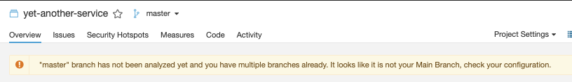
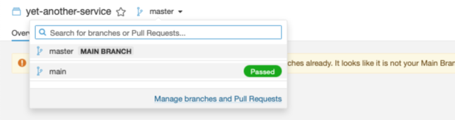
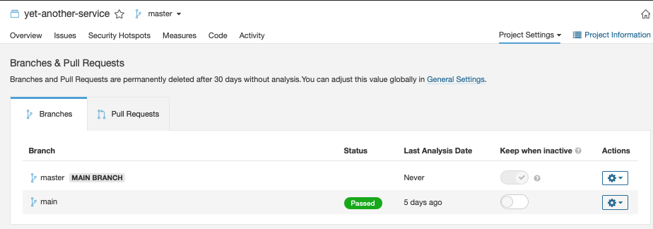

# 11. SonarQube Projects

Date: 2021-07-14

## Status

Draft

## Context

Project creation in GitLab can automatically include the build pipeline that will
automatically create a SonarQube project based on an embedded properties file.  This
works in some cases but many Sonar versions have a flaw when the projects default
branch name is not "master".  See [How to change the main branch] in the sonarsource
forums for a discussion of the topic.

The result of creating a new project with a default branch of "main" is that the
analysis that creates the project will create a "master" branch as the mainline
branch.  The analysis creates another branch named "main" and saves the analysis
results there.  In this state, the dashboard for the service is empty as shown below:

The "main" branch analysis is available from the branch selector:

The solution is to edit the branches and rename the "MAIN BRANCH" to "main".  Since
you already have a branch named "main", you have to delete it, rename the "MAIN
BRANCH", and then re-run the analysis.

This can be avoided by creating the project from within Imbi as an automation.

[How to change the main branch]: https://community.sonarsource.com/t/how-to-change-the-main-branch-in-sonarqube/13669

## Decision

Add a configured SonarQube API token that will be used to create new projects
*before* committing the first commit to GitLab.  A SonarQube project will only
be created when the API token is present in the configuration.  The token value
will be configured as `automations.sonar.admin_token` in the configuration file.

I chose to not use a per-user token since project creation is usually restricted
to a set of users.  Creating a token for the "admin" user is a simpler approach.

## Consequences

The feature is opt-in since it depends on the presence of a configured SonarQube
API token.

We can set additional links and properties on the individual projects to enhance
cross-linking -- for example, adding a project_link for the Imbi dashboard.
